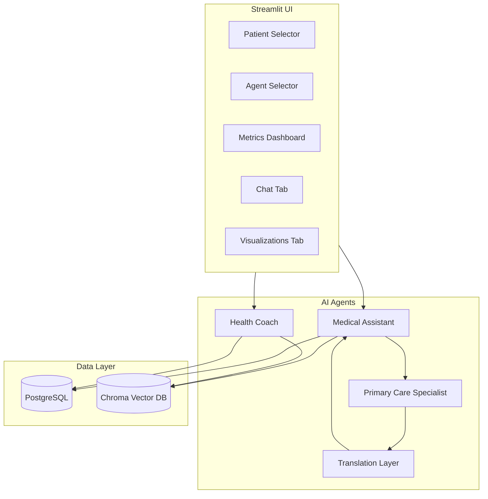
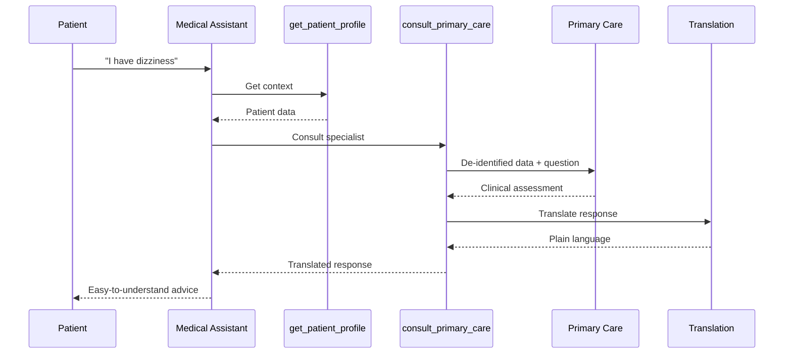
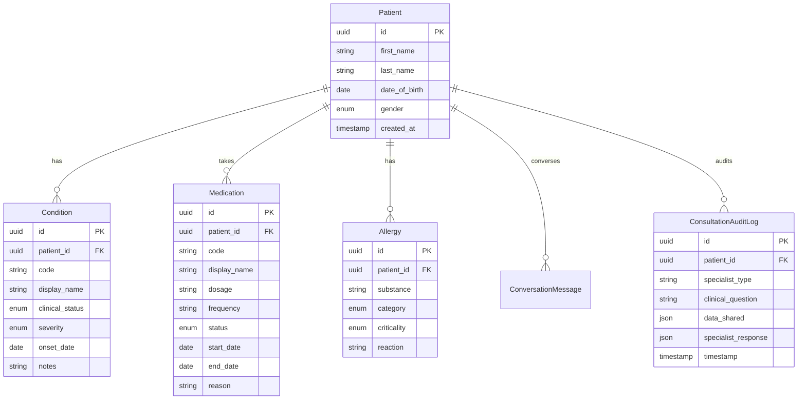
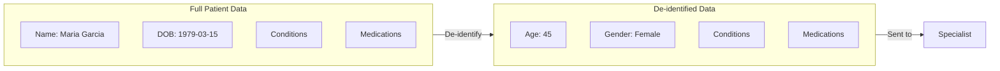
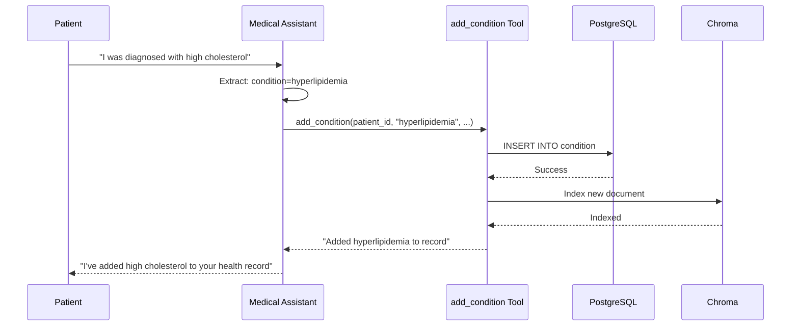
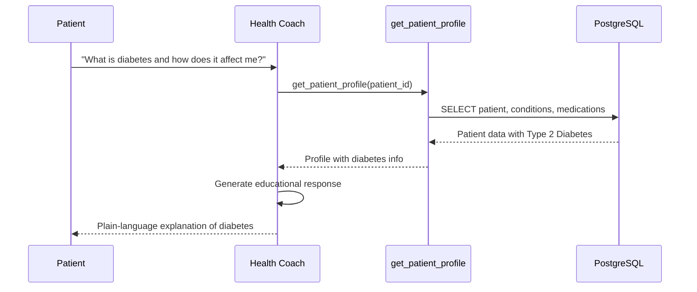

# System Architecture

This document describes the architecture of the Patient Digital Twin system.

## High-Level Overview



## Component Details

### 1. Streamlit UI Layer

The user interface is built with Streamlit and consists of:

| Component | File | Purpose |
|-----------|------|---------|
| Patient Selector | `streamlit_app.py` | Select which patient to view/chat with |
| Agent Selector | `streamlit_app.py` | Switch between Medical Assistant and Health Coach |
| Metrics Dashboard | `streamlit_app.py` | Display health metrics at a glance |
| Chat Interface | `streamlit_app.py` | Conversational interface with agents |
| Visualizations | `streamlit_app.py` | Plotly charts for health data |
| Sidebar | `streamlit_app.py` | Patient profile and consultation audit log |

### 2. Agent Layer

#### Medical Assistant (`src/agents/medical_assistant.py`)

The primary patient-facing agent with full capabilities:

```
Tools Available:
- get_patient_profile: Retrieve complete health profile
- search_patient_data: RAG-powered semantic search
- add_condition: Add new conditions to record
- add_medication: Add new medications to record
- add_allergy: Add new allergies to record
- consult_primary_care: Consult specialist agent
```

**Flow:**



#### Health Coach (`src/agents/health_coach.py`)

A consumer-friendly agent focused on education and motivation:

```
Tools Available (Read-Only):
- get_patient_profile: Retrieve health profile
- search_patient_data: RAG-powered semantic search
```

**Key Differences from Medical Assistant:**

| Aspect | Medical Assistant | Health Coach |
|--------|-------------------|--------------|
| Data Modification | Yes | No |
| Specialist Consultation | Yes | No |
| Clinical Advice | Yes (via specialist) | No - redirects |
| Tone | Professional | Warm, encouraging |
| Focus | Clinical management | Education, motivation |

#### Primary Care Specialist (`src/agents/primary_care.py`)

An internal agent that provides clinical assessments:

- Only accessed by Medical Assistant (never directly by patient)
- Receives de-identified data only
- Returns structured clinical response with recommendations
- Response is translated before reaching patient

#### Translation Layer (`src/agents/translation.py`)

Converts clinical language to patient-friendly text:

- Input: Complex medical terminology
- Output: 6th-grade reading level
- Preserves meaning while simplifying language

### 3. Data Layer

#### PostgreSQL Database

Stores structured health records:



#### Chroma Vector Store

Enables semantic search over patient data:

```
Document Types Indexed:
- Condition documents (name, status, severity, notes)
- Medication documents (name, dosage, frequency, reason)
- Allergy documents (substance, reaction, criticality)

Embedding Model: all-MiniLM-L6-v2
Persistence: data/embeddings/
```

### 4. Tool System

Tools are defined using LangChain's `@tool` decorator:

```python
@tool
def get_patient_profile(patient_id: str) -> str:
    """Get complete patient health profile."""
    # Implementation
```

**Tool Collections:**

| Collection | Tools | Used By |
|------------|-------|---------|
| `PATIENT_DATA_TOOLS` | profile, search, add_* | Medical Assistant |
| `CONSULTATION_TOOLS` | consult_primary_care | Medical Assistant |
| `HEALTH_COACH_TOOLS` | profile, search | Health Coach |
| `ALL_TOOLS` | All of the above | Medical Assistant |

### 5. Privacy Architecture

#### De-identification Flow



**What's Shared:**

- Age (calculated)
- Gender
- Condition names
- Medication names + dosages
- Allergy substances

**What's NOT Shared:**

- Patient name
- Date of birth
- Addresses
- Contact information
- Patient ID

### 6. Visualization System

Built with Plotly and displayed in Streamlit:

| Chart | Type | Data Source |
|-------|------|-------------|
| Medication Timeline | Gantt/Timeline | Medications with start/end dates |
| Severity Distribution | Donut | Condition severities |
| Consultation History | Bar | Audit log timestamps |

## Data Flow Examples

### Example 1: Adding a Condition



### Example 2: Health Education (Health Coach)



## Configuration

### Environment Variables

| Variable | Purpose | Default |
|----------|---------|---------|
| `DATABASE_URL` | PostgreSQL connection | `postgresql://localhost/patient_twin` |
| `LLM_PROVIDER` | AI provider | `google` |
| `LLM_MODEL` | Model name | Provider default |
| `GOOGLE_API_KEY` | Google API key | Required for Google |
| `ANTHROPIC_API_KEY` | Anthropic API key | Required for Anthropic |
| `OPENAI_API_KEY` | OpenAI API key | Required for OpenAI |
| `LOG_LEVEL` | Logging level | `INFO` |

### LLM Provider Configuration

```python
# src/llm/factory.py
def get_chat_model():
    provider = os.getenv("LLM_PROVIDER", "google")
    if provider == "google":
        return ChatGoogleGenerativeAI(...)
    elif provider == "anthropic":
        return ChatAnthropic(...)
    elif provider == "openai":
        return ChatOpenAI(...)
```

## Testing Architecture

```
tests/
├── test_health_coach.py    # Health Coach agent tests
├── test_models.py          # SQLAlchemy model tests
├── test_repositories.py    # Data access layer tests
├── test_rag.py             # RAG system tests
└── test_tools.py           # Agent tool tests
```

**Test Coverage:** 144 tests covering all major components.

## Security Considerations

1. **No PHI in Logs**: Patient names and DOB are never logged
2. **De-identification**: Specialist consultations use de-identified data
3. **Audit Trail**: All consultations logged with data shared
4. **Tool Isolation**: Health Coach has read-only access
5. **Input Validation**: Pydantic schemas validate all inputs
